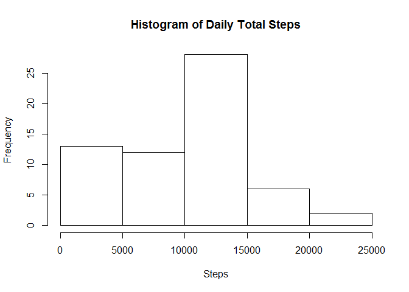
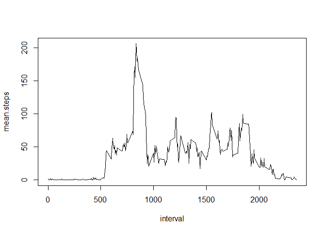
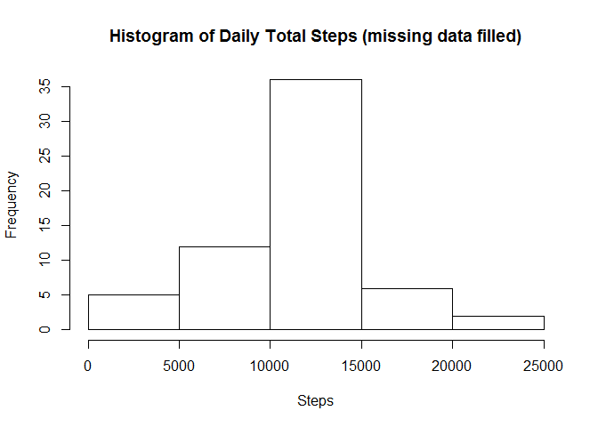
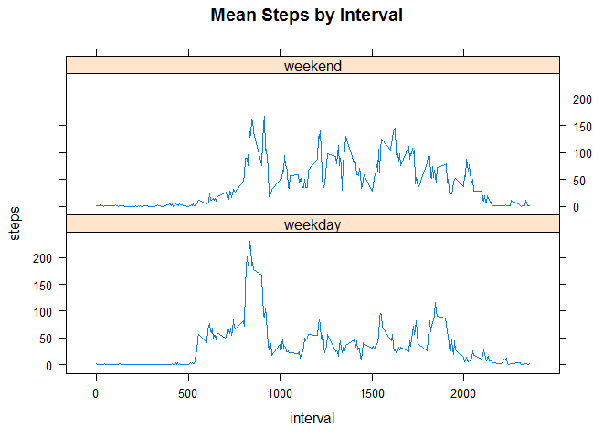

# Reproducible Research: Peer Assessment 1


## Loading and preprocessing the data
1. load data
1. change interval data type to factor
1. change data from data frame to tbl


```r
library(dplyr)
```


```r
data <- read.csv(unz("activity.zip", "activity.csv"))
data$interval <- as.factor(as.character(data$interval))
data <- tbl_df(data)
```


## What is mean total number of steps taken per day?
1. group data by date
1. calculate daily total steps using summarise
1. graph histogram with daily total steps
1. calculate mean and media with summary


```r
data.by.date <- group_by(data,date)
daily.total <- summarise(data.by.date, sum(steps, na.rm = TRUE))
names(daily.total)[2] <- "daily.total.steps"

hist(daily.total$daily.total.steps, main="Histogram of Daily Total Steps",
     xlab = "Steps")
```



```r
summary <- summary(daily.total$daily.total.steps)
summary
```

```
##    Min. 1st Qu.  Median    Mean 3rd Qu.    Max. 
##       0    6778   10400    9354   12810   21190
```
The **mean** of total number of steps taken per day is **9354** and the **median** is **10400**.

## What is the average daily activity pattern?
1. group data by interval
1. calculate mean for each interval
1. change type of interval to numeric and sort data.by,interval by interval
1. plot it


```r
data.by.interval <- group_by(data,interval)
mean.by.interval <- summarise(data.by.interval, mean(steps, na.rm=TRUE))
names(mean.by.interval)[2] <- "mean.steps"

mean.by.interval$interval <- as.numeric(as.character(mean.by.interval$interval))
mean.by.interval.sorted <- mean.by.interval[order(mean.by.interval$interval),]
with(mean.by.interval.sorted, plot(interval, mean.steps, type="l"))
```




## Imputing missing values
1. calculate total number of missing value
1. add mean.steps column to data by merging "data" and "mean.by.interval.sorted" and name this new dataset to "data.filled"
1. If steps column is NA, set the value to that in mean.steps. we are imputing NA with mean value from the interval. We selected only the first 3 column. the new data.filled dataset will be the same with data but missing data is filled in
1. calculate daily total on this new dataset by grouping the dataset by date then summarise it.
1. plot histogram


```r
data.missing <- data[is.na(data$steps),]
dim(data.missing)
```

```
## [1] 2304    3
```

```r
data.filled <- merge(data, mean.by.interval.sorted, by.x = "interval", by.y="interval")
data.filled <- transform(data.filled, steps = ifelse(is.na(steps), mean.steps, steps))
data.filled <- select(data.filled, 1:3)
data.filled.by.date <- group_by(data.filled, date)
sum.by.date <- summarise(data.filled.by.date, daily.sum=sum(steps))
hist(sum.by.date$daily.sum, main="Histogram of Daily Total Steps (missing data filled)",
     xlab = "Steps")
```



## Are there differences in activity patterns between weekdays and weekends?

1. change date column's type to Date and find the day of week for each day, then assign "weekend" or "weekday" to the day column. Finally make day column as factor


```r
data.filled$date <- as.Date(data.filled$date)
data.filled$day <- weekdays(data.filled$date)
data.filled$day <- ifelse(data.filled$day == "Sunday", "weekend", 
                                     ifelse(data.filled$day == "Saturday", "weekend", "weekday"))
data.filled$day <- as.factor(data.filled$day)
```

2. sort the dataset by interval
3. group the sorted dataset by interval and day, then compute the mean for each group


```r
data.filled$interval <- as.numeric(as.character(data.filled$interval))
data.filled.sorted <- data.filled[order(data.filled$interval),]

data.filled.by.int.day <- group_by(data.filled.sorted, interval, day)
data.sum.by.int.day <- summarise(data.filled.by.int.day, mean.steps = mean(steps))
```

4. plot them in two panel(weekday, weekend) using lattice


```r
library(lattice)
```


```r
xyplot(mean.steps ~ interval | day, data = data.sum.by.int.day, layout=c(1,2), 
       type="l", ylab = "steps", main="Mean Steps by Interval")
```



